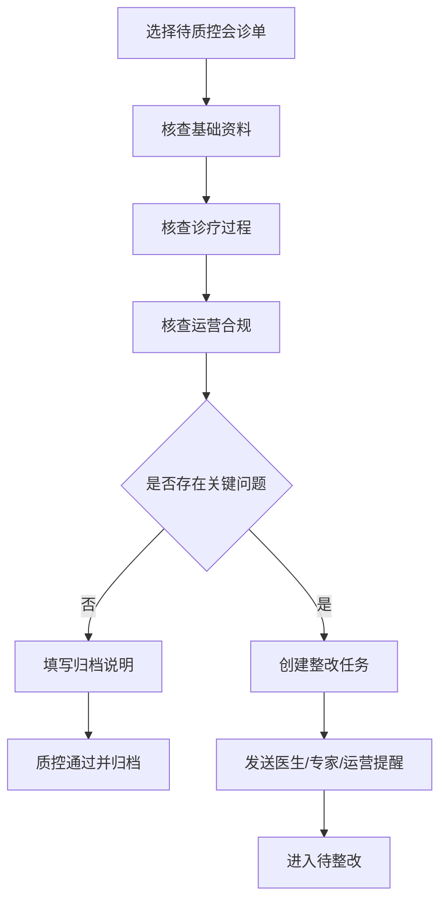
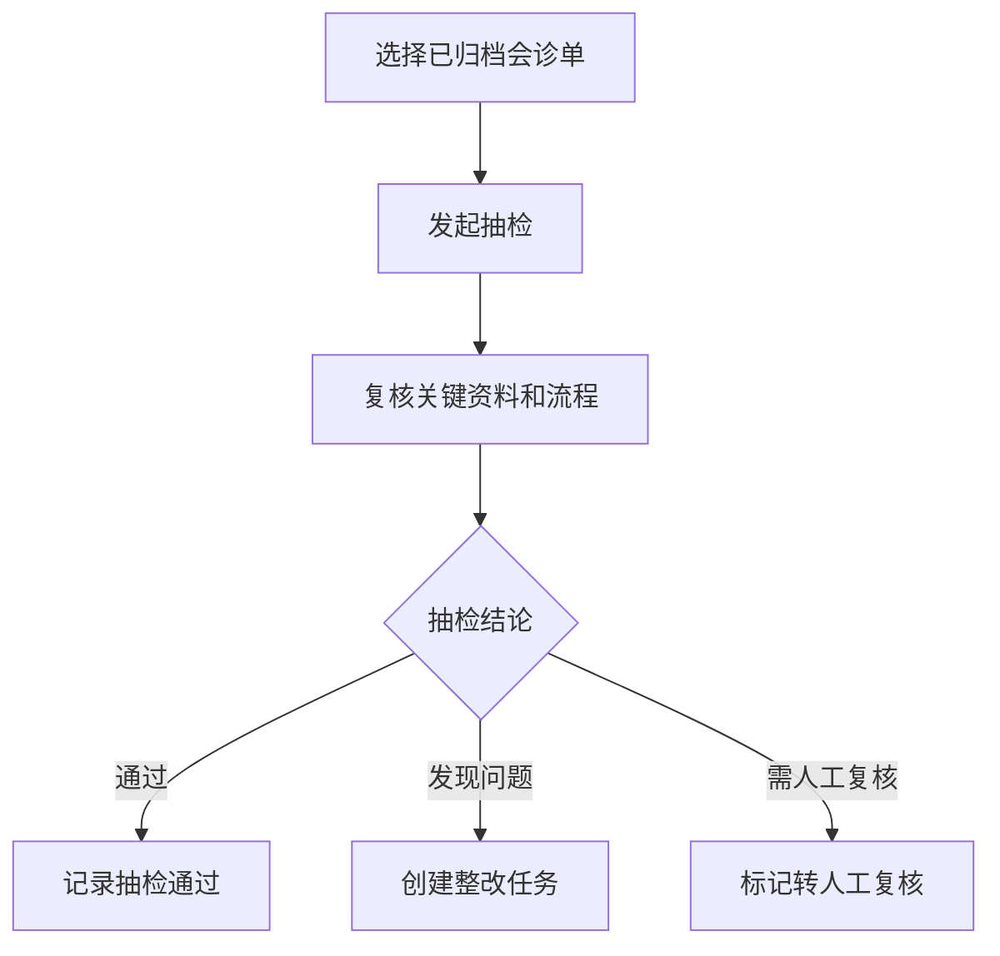

# 质控归档中心设计规格

**日期**: 2026-07-01  
**状态**: Draft for review  
**范围**: 运营管理端的“质控归档”入口

## 背景

当前“质控归档”页面只覆盖单个实时会诊单，包含固定质控清单、完成度、归档按钮和流程/建议预览。这个设计能演示归档动作，但不能支持运营人员日常处理多个会诊单，也缺少问题发现、整改闭环、抽检复核和统计管理能力。

新的定位是“质控归档中心”：同时支持逐单办理和管理审计。页面既要让运营人员快速完成待归档单据，也要能看到质量问题、整改状态和抽检结果。

## 目标

- 建立待质控、待整改、可归档、已归档、抽检中等状态视图。
- 支持运营人员逐单核查资料、专家建议、医生处置、流程时效和风险闭环。
- 支持标记问题、填写质控意见、退回医生或专家补充。
- 支持满足条件后一键归档，并生成运营记录。
- 提供轻量统计，让管理者看到待处理量、整改量、通过率和常见问题。
- 保持当前演示应用的前端本地状态模式，不引入后端或持久化服务。

## 非目标

- 不做真实文件存储、电子签章、医保/病案系统接口。
- 不做复杂权限体系，只按当前运营端角色演示。
- 不做完整 BI 报表平台，统计只服务当前页面判断。
- 不改变医生端、专家端的既有核心流程，除非整改通知需要复用现有提醒能力。

## 页面信息架构

质控归档中心分为四个区域。

### 1. 质控概览

顶部展示关键指标：

| 指标 | 含义 |
| --- | --- |
| 待质控 | 状态为 completed 或运营判定需要质控的会诊单 |
| 有缺项 | 必要资料、建议、处置或流程节点不完整 |
| 整改中 | 已创建整改任务，等待责任方处理 |
| 可归档 | 质控必检项全部通过 |
| 今日归档 | 当日已归档数量 |
| 抽检通过率 | 已归档抽检中通过的比例 |

指标卡可点击筛选下方队列。第一版可用静态计算和本地状态模拟。

### 2. 质控队列

队列用于处理多张会诊单。每条记录展示：

- 患者、科室、申请医生、会诊专家。
- 当前会诊状态和质控状态。
- 等待时长或归档时长。
- 风险等级。
- 缺项数量。
- 最近质控意见。

建议提供筛选标签：

- 全部
- 待质控
- 有缺项
- 待整改
- 可归档
- 已归档
- 抽检中

点击记录后进入右侧办理面板。

### 3. 质控办理面板

办理面板围绕当前选中会诊单展开，分成三组。

**基础核查**

- 会诊申请信息完整。
- 患者基础信息完整。
- 主诉和会诊目的明确。
- 必要附件已上传。
- 附件类型满足专家要求。

**诊疗过程核查**

- 专家预审节点完整。
- 资料补充节点完整。
- 预约/会诊节点完整。
- 专家结构化建议完整。
- 医生本地处置已确认。
- 风险提示已被医生知晓或处理。

**运营合规核查**

- SLA 未超时或已有超时说明。
- 沟通记录可追溯。
- 催办和运营备注完整。
- 归档说明已填写。
- 质控结论明确。

每项有三种结果：

- 通过
- 不通过
- 不适用

第一版可以先用切换按钮或分段控件实现，不需要复杂表单。

### 4. 问题整改与抽检

当任一关键项“不通过”时，归档按钮不可用。运营人员可以创建问题：

| 问题类型 | 默认责任方 | 典型动作 |
| --- | --- | --- |
| 资料缺失 | 医生端 | 退回补充资料 |
| 专家建议不完整 | 专家端 | 提醒完善建议 |
| 医生处置未确认 | 医生端 | 催办确认处置 |
| 流程超时 | 运营端 | 记录原因并复核 |
| 风险未闭环 | 医生端 | 要求补充处置说明 |
| 沟通记录不足 | 运营端 | 补充运营备注 |

整改任务展示在当前会诊单下，也可以汇总到“整改中”筛选。第一版用本地状态模拟任务创建、状态切换和提醒发送。

已归档记录可进入抽检：

- 抽检状态：未抽检、抽检中、通过、发现问题。
- 抽检结论：通过、需整改、转人工复核。
- 抽检说明：文本备注。

## 核心操作流程

### 待质控到归档



### 已归档抽检



## 数据状态设计

第一版可以在 `AdminView` 内维护本地 UI 状态，后续再抽到独立 domain 模块。

建议新增概念：

```ts
type QualityCaseStatus =
  | "pending_review"
  | "missing_items"
  | "rectification"
  | "ready_to_archive"
  | "archived"
  | "sampling"
  | "sample_passed"
  | "sample_issue"

type QualityCheckResult = "pass" | "fail" | "na"

interface QualityIssue {
  id: string
  type: "missing_attachment" | "incomplete_advice" | "missing_disposition" | "sla_overdue" | "risk_unclosed" | "insufficient_message"
  ownerRole: "doctor" | "expert" | "admin"
  note: string
  status: "open" | "reminded" | "resolved"
}
```

归档条件：

- 当前会诊单状态为 `completed`，或演示队列中的历史记录具备专家建议和医生处置。
- 关键质控项没有 `fail`。
- 存在归档说明。
- 所有开放整改问题已解决或标记为不影响归档。

## UI 建议

页面可以采用 `xl:grid-cols-[360px_minmax(0,1fr)]` 的工作台布局：

- 左侧：质控概览、筛选、会诊队列。
- 右侧：当前会诊单办理面板。
- 右侧面板内使用 tabs 或分段按钮切换：
  - 核查清单
  - 问题整改
  - 归档包
  - 抽检复核

为了避免页面过重，第一版只在右侧面板中展示当前会诊单的关键摘要，不重复完整病历详情。需要完整详情时保留“查看会诊明细”按钮或折叠区。

## 与现有功能的衔接

- 继续复用 `getAdminCaseRecords(session)` 作为队列来源。
- 继续复用 `admin.sendReminder` 发送整改提醒。
- 继续复用 `admin.archive` 完成最终归档。
- 继续展示 `WorkflowTimeline`、`AdvicePanel` 的简版预览，但不要让它们占据主流程。
- 当前 `qualityItems` 会升级为分组化质控项。

## 测试策略

至少覆盖：

- 质控页面展示多个质控状态和队列。
- 选择会诊单后办理面板更新。
- 存在不通过项时，归档按钮禁用。
- 创建整改问题后，记录进入整改中。
- 发送整改提醒会调用现有 `admin.sendReminder` 行为。
- 所有关键项通过且填写归档说明后，可以触发归档。
- 已归档记录可以发起抽检并记录抽检结论。

## 分阶段实现建议

### Phase 1: 质控归档中心骨架

- 替换当前单卡片页面为概览 + 队列 + 办理面板。
- 支持质控状态筛选和选中记录。
- 展示分组质控清单和归档按钮状态。

### Phase 2: 问题整改

- 增加问题类型、责任方、整改说明。
- 支持创建整改任务、发送提醒、标记解决。
- 将整改状态反映到队列和指标。

### Phase 3: 抽检复核

- 对已归档记录发起抽检。
- 记录抽检结论。
- 将抽检通过率和问题数量反映到概览。

### Phase 4: 体验打磨

- 补充空状态、禁用态、提示文案。
- 优化移动端和窄屏布局。
- 补齐浏览器截图验证。

## 开放问题

- 第一版是否允许“带说明归档”，即存在轻微问题但运营填写原因后仍可归档？
- 整改任务是否需要出现在独立“流程催办”入口，还是只保留在质控中心内？
- 抽检是否只针对已归档单，还是待归档单也允许先抽检？
- 质控清单是否要按科室/病种有不同模板，还是第一版统一模板即可？
