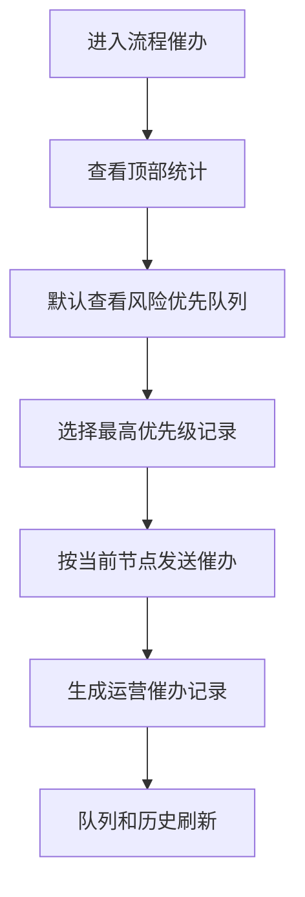
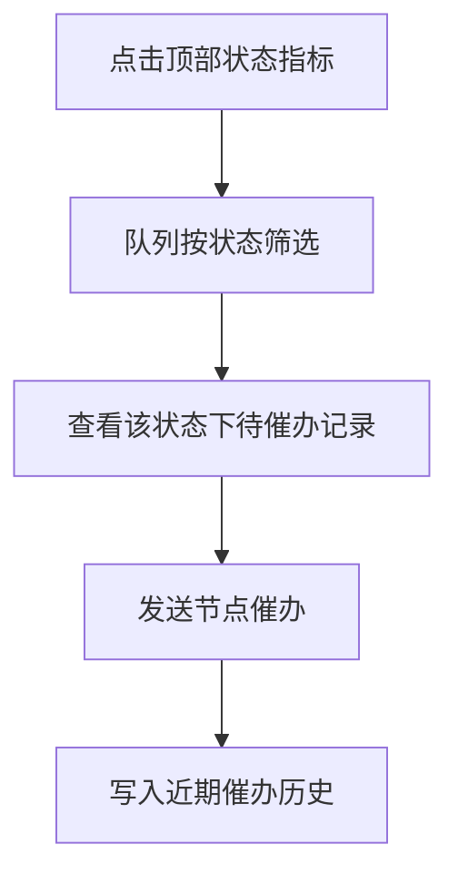

# 运营流程催办工作台设计规格

**日期**: 2026-07-02  
**状态**: Draft for review  
**范围**: 运营管理端的“流程催办”入口

## 背景

当前“流程催办”页面已经包含催办模板、待催办队列和近期催办记录，但页面重心偏向“可以发送哪些模板”。运营人员真正的日常任务是判断哪些会诊单最需要跟进，并尽快完成催办动作。

新的定位是“流程催办工作台”：页面先展示当前各类待催办压力，再把风险最高、最接近 SLA 的会诊单排到前面，最后保留近期催办记录用于追溯。

## 目标

- 让运营人员进入页面后先看到待催办总量、风险量和各流程状态的分布。
- 让状态统计数字可作为队列筛选入口。
- 让待催办队列按风险和时效排序，而不是只按固定顺序展示。
- 让每条队列记录显示责任方、等待时长、SLA、上次催办和主操作。
- 让催办动作默认使用当前节点推荐文案，同时保留模板能力。
- 保留近期催办历史，支持运营追溯和质控复盘。
- 保持当前前端本地演示模式，不引入后端、真实消息通道或持久化服务。

## 非目标

- 不做真实短信、电话、企微、飞书或站内信发送。
- 不做完整催办审批流。
- 不做复杂权限体系。
- 不做跨页全局搜索或完整报表平台。
- 不改变医生端、专家端既有主流程。

## 方案取舍

### 方案 A: 模板优先

页面继续以催办模板为主体，运营先选择模板，再选择或理解适用状态。

优点是改动小，保留现有结构。缺点是运营仍然要先想“发什么”，而不是先处理“谁最急”。

### 方案 B: 状态优先

页面按“待专家预审、待医生补资料、待专家建议、待医生确认”等状态分组，每组内部展示待催办记录。

优点是流程结构清晰。缺点是在紧急和超时场景下，运营可能需要跨多个分组查找风险最高的单。

### 方案 C: 风险优先 + 状态统计筛选

顶部展示状态统计和风险统计。中部队列默认按风险、SLA 和等待时长排序。点击顶部统计后，队列切换为对应状态筛选。

这是推荐方案。它既保留状态总览，又保证运营第一时间处理最紧急的单。

## 页面信息架构

页面采用上下结构。

### 1. 催办概览

顶部使用紧凑指标卡展示关键数字。每个指标卡都能筛选下方队列。

| 指标 | 含义 | 默认筛选 |
| --- | --- | --- |
| 全部待催办 | 当前责任方为医生或专家的会诊单 | 全部 |
| 逾期/风险 | 紧急、警告、接近或超过 SLA 的会诊单 | 风险优先 |
| 待专家预审 | 状态为 `pending_expert` 的会诊单 | 专家预审 |
| 待医生补资料 | 状态为 `needs_more_info` 的会诊单 | 医生补资料 |
| 会诊前提醒 | 状态为 `scheduled` 的会诊单 | 会诊准备 |
| 待专家建议 | 状态为 `pending_advice` 或会诊中需要专家补建议的会诊单 | 专家建议 |
| 待医生确认 | 状态为 `pending_doctor_confirm` 的会诊单 | 医生确认 |

第一版展示 6 个指标：“全部待催办、逾期/风险、待专家预审、待医生补资料、待专家建议、待医生确认”。“会诊前提醒”作为队列中的状态标签和排序因素，不单独占用顶部指标位。

### 2. 待催办队列

队列是页面主体。默认按以下优先级排序：

1. 紧急会诊单。
2. 已超时或接近 SLA 的会诊单。
3. 会诊前准备提醒。
4. 待专家处理。
5. 待医生处理。
6. 其他可催办记录。

每条记录展示：

- 患者姓名、科室、会诊单号。
- 当前流程状态。
- 当前责任方：医生、专家或双方。
- 等待时长。
- SLA 标签。
- 风险等级。
- 上次催办时间或“未催办”。
- 操作按钮。

主操作按钮根据状态自动变化：

| 状态 | 主按钮 |
| --- | --- |
| `draft` | 催医生提交 |
| `pending_expert` | 催专家预审 |
| `needs_more_info` | 催医生补资料 |
| `scheduled` | 提醒医生/专家 |
| `in_consultation` | 提醒双方 |
| `pending_advice` | 催专家提交建议 |
| `pending_doctor_confirm` | 催医生确认处置 |

队列应支持点击记录查看简要详情。详情第一版可以以内联展开或右侧轻量摘要实现，不要求完整病例详情。

### 3. 催办模板入口

催办模板不再作为页面主体。模板能力转移到操作上下文中：

- 点击队列中的“催办”按钮后，第一版直接使用当前节点推荐文案发送。
- 页面不新增弹窗编辑文案，避免打断批量催办节奏。
- 现有模板能力保留为“快捷模板”辅助区，但不作为页面主体。
- 后续如果需要运营编辑文案，再把推荐文案升级为弹窗或抽屉。

### 4. 近期催办历史

近期催办历史放在队列下方。它用于审计追溯，不抢占主操作区。

每条记录展示：

- 催办时间。
- 催办对象：医生端或专家端。
- 催办标题。
- 关联患者或会诊单号。
- 操作人。
- 催办来源：节点催办或模板催办。

第一版展示最近 6-8 条。后续可以增加状态筛选和全文搜索。

## 核心操作流程

### 默认进入流程



### 状态筛选流程



## 数据和计算规则

第一版继续复用 `getAdminCaseRecords(session)` 和 `getDefaultOperationLogs(session)`。

建议新增派生概念，不需要立刻新增持久化模型：

```ts
type ReminderFilter =
  | "all"
  | "risk"
  | "pending_expert"
  | "needs_more_info"
  | "scheduled"
  | "pending_advice"
  | "pending_doctor_confirm"

interface ReminderQueueItem {
  record: AdminCaseRecord
  targetRole?: "doctor" | "expert"
  statusLabel: string
  primaryActionLabel: string
  lastReminderAt?: string
  reminderSource: "node" | "template"
  priorityScore: number
}
```

`priorityScore` 可以由以下因素加权：

- `riskLevel === "urgent"` 权重最高。
- `riskLevel === "warning"` 次之。
- `priority === "urgent"` 加权。
- 状态为 `scheduled` 且临近预约时间加权。
- 状态为 `pending_advice` 且会诊后等待较久加权。
- 近期已催办的记录降权，避免重复打扰。

第一版使用确定性排序，不做复杂时间解析。近期已催办的记录在队列中显示“已催办”提示，并排在同风险等级的未催办记录之后。

## UI 建议

页面结构：

1. 顶部标题区：流程催办、今日关注说明。
2. 指标卡区：一行或两行状态统计，卡片可点击。
3. 主队列区：宽表或列表，风险优先排序。
4. 历史区：最近催办记录列表。

桌面端建议：

- 指标卡使用 `md:grid-cols-3`、`xl:grid-cols-6`。
- 队列使用表格或密集列表，保证运营能扫视多条记录。
- 历史区放在队列下方，避免与主队列竞争视觉焦点。

移动或窄屏：

- 指标卡两列。
- 队列改为卡片。
- 历史区继续纵向排列。

视觉风格应延续运营端当前风格：克制、信息密度高、边框清晰、强调风险色但避免过度装饰。

## 与现有功能的衔接

- 继续复用 `sendContextReminder(record)` 作为按当前节点催办的动作。
- 继续复用 `reminderTemplates` 作为模板来源。
- 继续复用 `OperationLogItem` 展示近期操作记录。
- 顶部统计可以复用或扩展 `getAdminCounts`，但建议单独为催办页派生 `getReminderStats`，避免工作台统计和催办统计互相耦合。
- 催办队列建议从 `records.filter((record) => record.currentOwnerRole)` 派生，但要增加风险排序和状态筛选。

## 测试策略

至少覆盖：

- 流程催办页展示顶部统计。
- 点击统计卡后，待催办队列按对应状态筛选。
- 默认队列把风险记录排在普通记录前。
- 每条队列记录展示责任方、等待时长、SLA 和主催办按钮。
- 点击主催办按钮触发 `admin.sendReminder`，并使用当前节点对应责任方。
- 近期催办历史展示 `reminder` 类型运营记录。
- 模板催办能力仍可访问，或至少不会被删除导致现有测试失效。

## 发布和验证

研发完成后，按照当前项目流程：

1. 运行 `npm run test:run`。
2. 运行 `npm run lint`。
3. 运行 `npm run build`。
4. 提交并推送到 `main`。
5. 等待 Vercel 自动部署。
6. 验证 `https://xiangxian.vercel.app/admin` 的流程催办入口。

## 第一版决策

- 不新增文案编辑弹窗；催办按钮直接发送当前节点推荐文案。
- 顶部展示 6 个指标。
- 近期已催办记录在队列中显示提示，并在同等风险下后置。
- `/expert` 保持专家端入口；运营端催办动作面向医生端和专家端发送提醒。
